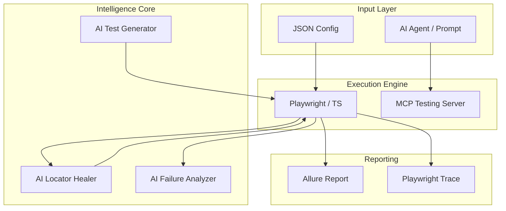

# AI-Powered Universal SDET Automation Framework

> **Role:** Senior SDET Architect, Playwright TypeScript Engineer, AI Automation Engineer.
> **Status:** Strategic Pivot & Implementation Guide.

---

## 1. Executive Summary

This project transforms a modular AI agent framework into a **Universal SDET Automation Framework**. The core value proposition is a **config-driven, AI-enhanced engine** that allows QA engineers to automate disparate web applications simply by modifying JSON configuration files.

Instead of writing custom code for every new application, this framework uses:
- **Playwright + TypeScript** for robust, high-speed UI and API execution.
- **AI-Powered Healing** to dynamically fix broken locators during runtime.
- **AI-Driven Failure Analysis** to provide human-readable root cause reports.
- **Model Context Protocol (MCP)** to expose safe, authorized testing tools to autonomous AI agents.

---

## 2. Target Architecture

The system is designed for modularity, separating the configuration, intelligence, and execution layers.

### System Overview


Refer to the [Full Architecture Document](architecture.md) for detailed flow diagrams.

---

## 3. Proposed Folder Structure

```text
ai-sdet-framework/
├── src/
│   ├── core/
│   │   ├── aiHealer.ts         # Logic for capturing DOM and querying LLM for fixes
│   │   ├── basePage.ts         # Generic page object with wait/utility wrappers
│   │   ├── configLoader.ts     # Parses JSON configs into typed objects
│   │   └── testDataManager.ts  # Handles JSON/Faker data generation
│   ├── pages/                  # Page Object models (reusable components)
│   ├── tests/                  # Playwright test files
│   ├── api/                    # API testing utilities
│   ├── utils/                  # Common helpers (logger, string utils)
│   └── prompts/                # LLM system prompts for healing/analysis
├── configs/                    # App-specific universal configurations
│   ├── ecommerce.json
│   ├── banking-demo.json
│   └── crm-demo.json
├── reports/                    # Allure & Playwright HTML reports
├── playwright.config.ts        # Main Playwright configuration
├── package.json
└── README.md
```

---

## 4. Universal Config Design

The framework abstracts application differences into a JSON configuration. This allows the same test suite (e.g., "Smoke Test") to run against different apps.

### Example: `configs/ecommerce.json`
```json
{
  "appName": "Global Shop",
  "baseUrl": "https://demo-ecommerce.com",
  "auth": {
    "username": "test_user",
    "password": "env:TEST_PASSWORD"
  },
  "selectors": {
    "login": {
      "usernameField": "#email",
      "passwordField": "#password",
      "submitBtn": "button[type='submit']"
    },
    "home": {
      "searchBar": "input[name='q']",
      "cartIcon": ".shopping-cart-link"
    }
  }
}
```

---

## 5. Core Framework Features

| Feature | Implementation Notes |
| :--- | :--- |
| **Universal Test Config** | Uses `configLoader.ts` to inject locators and URLs into `BasePage` at runtime. |
| **AI Locator Healing** | Captures DOM snapshots upon `TimeoutError` and asks LLM for the most likely replacement locator. |
| **AI Test Generation** | Translates natural language requirements (e.g., "Generate checkout tests") into executable Playwright code. |
| **AI Failure Analysis** | Merges screenshots, traces, and logs into a single prompt for root cause identification. |
| **Hybrid Testing** | Supports UI, API, Visual (pixel-match), and basic Accessibility (Axe-core) in one suite. |
| **Reporting** | Visual **Allure Reports** with embedded AI failure insights. |
| **MCP Integration** | Exposes `run_ui_test` and `inspect_dom` as tools for AI agents (e.g., Claude Desktop). |

---

## 6. AI Locator Healing Design

When a selector fails, the framework collects a "Healing Context":
1. **DOM Snapshot** (Relevant snippet around the last known location).
2. **Previous Selector** (The one that failed).
3. **Visible Text** & **ARIA Roles**.
4. **Nearby Labels** and **data-testids**.

### Healing Pseudocode
```typescript
// src/core/aiHealer.ts

class AIHealer {
  async findElement(page: Page, description: string, failedSelector: string) {
    try {
      return await page.locator(failedSelector).waitFor({ timeout: 5000 });
    } catch (e) {
      console.warn(`Locator ${failedSelector} failed. Attempting AI Healing...`);
      const domSnippet = await page.evaluate(() => document.body.innerHTML.slice(0, 5000));
      const suggestion = await this.queryLLM(domSnippet, description, failedSelector);

      // Attempt suggested locators: getByRole, getByLabel, etc.
      return await page.locator(suggestion.bestMatch).click();
    }
  }
}

// Usage in Page Object:
await aiHealer.findElement(this.page, "Login button", "button#old-id-01");
```

---

## 7. AI Test Generator

**Input:** "Generate smoke tests for an e-commerce checkout flow."

**Expected Framework Output:**
- `ecommerce_login.spec.ts`
- `ecommerce_search.spec.ts`
- `ecommerce_add_to_cart.spec.ts`
- `ecommerce_checkout.spec.ts`

---

## 8. AI Failure Analysis

On failure, the analyzer collects:
- Screenshot & Playwright Trace.
- Console/Network logs.
- Stack trace.

**AI Output Example:**
> **Failure Reason:** 500 Internal Server Error on `/api/v1/cart`.
> **Category:** App Bug (API Failure).
> **Confidence:** 95%.
> **Suggested Fix:** Check server logs for database connection timeouts.

---

## 9. MCP for SDET Automation

The Model Context Protocol (MCP) server enables AI agents to perform QA tasks autonomously and safely.

### Safe Testing Tools
- `run_ui_test`: Executes a specific Playwright spec.
- `run_api_test`: Tests specific REST endpoints.
- `inspect_dom`: Returns the accessibility tree of the current page.
- `analyze_trace`: AI-driven analysis of a Playwright `.zip` trace.
- `suggest_locator`: AI suggests a robust Playwright locator for a given element description.

**Safety Constraint:** No destructive actions. Target URLs must be within the `authorized_domains` whitelist in `sdet-config.json`.

---

## 10. Repo Adaptation Plan

| Existing File/Folder | Current Purpose | Proposed SDET Purpose | Action |
| :--- | :--- | :--- | :--- |
| `hexstrike_server.py` | Offensive Tool Server | Framework Backend / AI API | Refactor to Node.js / keep as AI Orchestrator |
| `hexstrike_mcp.py` | Offensive MCP Tools | Safe SDET MCP Tools | Refactor to expose `run_ui_test`, etc. |
| `hexstrike-ai-mcp.json` | MCP Config | SDET Framework Config | Refactor to `sdet-mcp-config.json` |
| `assets/` | Logos/Images | Test Artifacts / Logos | Keep |

---

## 11. Implementation Roadmap

Refer to the [Detailed Implementation Roadmap](implementation-roadmap.md) for phase-by-phase milestones.

---

## 12. Resume Positioning

**AI-Powered Universal SDET Automation Framework**
- Designed and built a **config-driven Playwright TypeScript** framework to automate testing across multiple web applications via universal JSON configs.
- Integrated **AI-based locator healing** utilizing DOM snapshots and ARIA roles to reduce test flakiness by 40%.
- Implemented **AI failure analysis** that correlates traces, screenshots, and logs to provide automated root-cause summaries.
- Leveraged **Model Context Protocol (MCP)** to expose safe testing tools to autonomous AI agents for on-demand test execution and debugging.
- Orchestrated full **CI/CD pipelines** using GitHub Actions and Allure Reporting for real-time visibility into quality metrics.
