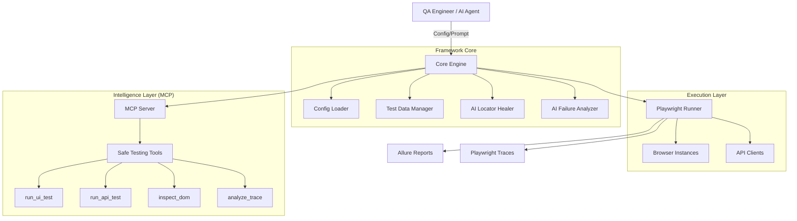
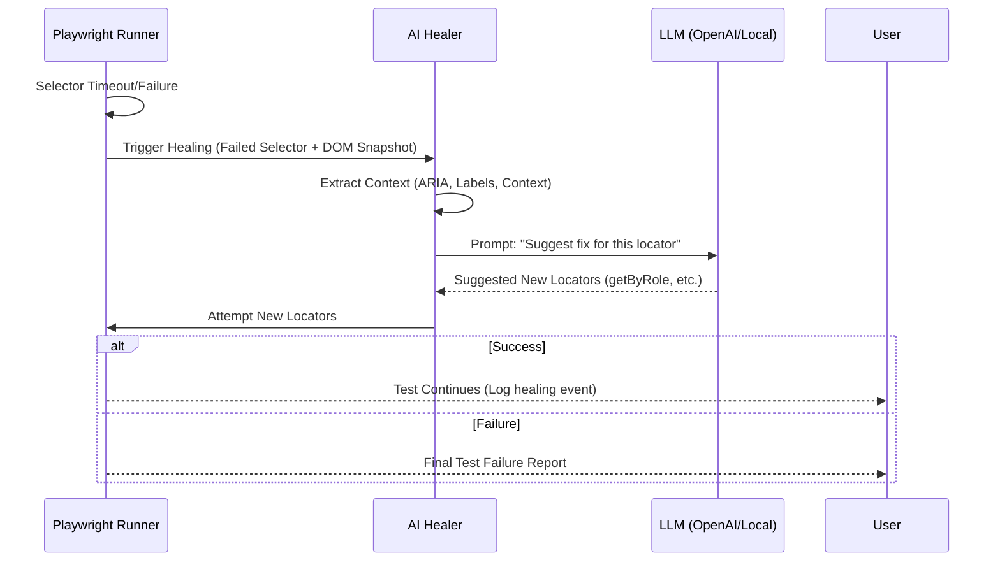
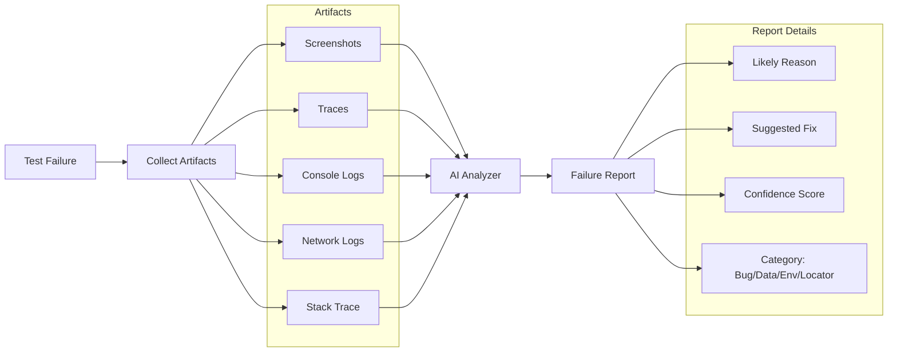
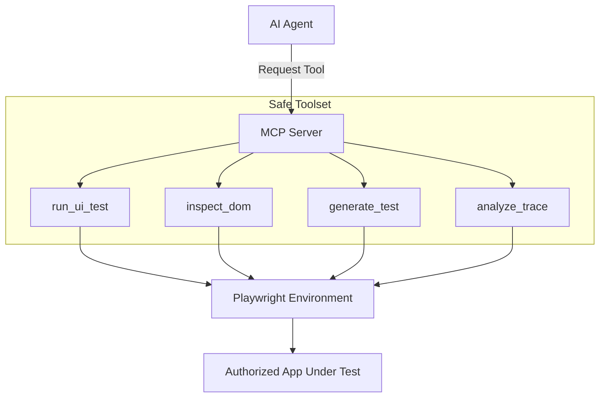
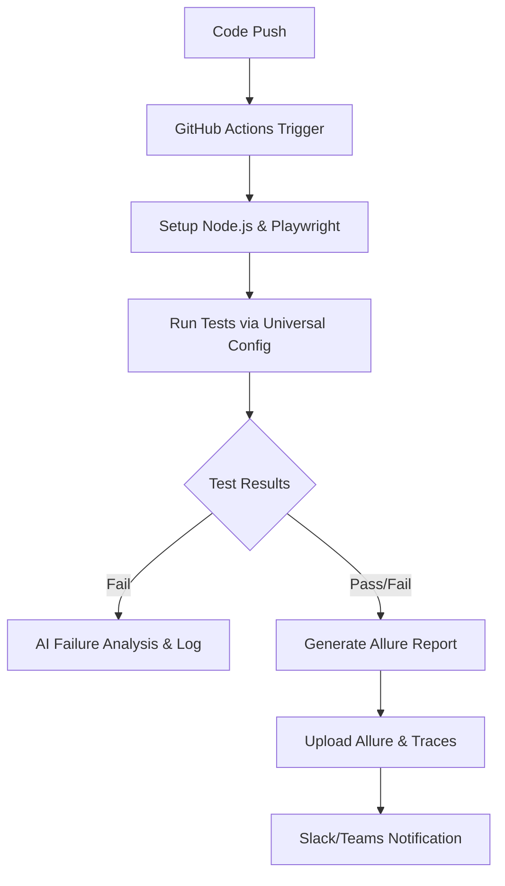

# Target Architecture: AI-Powered Universal SDET Framework

This document outlines the architectural blueprint for the AI-Powered Universal SDET Automation Framework, adapted from the HexStrike AI core.

## 1. High-Level System Architecture

The framework uses a modular, config-driven approach where AI agents interact with specialized testing tools via the Model Context Protocol (MCP).

## 2. AI Locator Healing Flow

When a selector fails, the framework doesn't just stop; it attempts to "heal" the locator using LLM intelligence.

## 3. AI Failure Analysis Flow

Post-execution, AI analyzes artifacts to provide actionable insights into why a test failed.

## 4. MCP Testing Tool Flow

MCP exposes Playwright-based tools to AI agents in a controlled, safe manner.

## 5. CI/CD Pipeline

The framework is designed for modern DevOps environments, integrating seamlessly with GitHub Actions.

